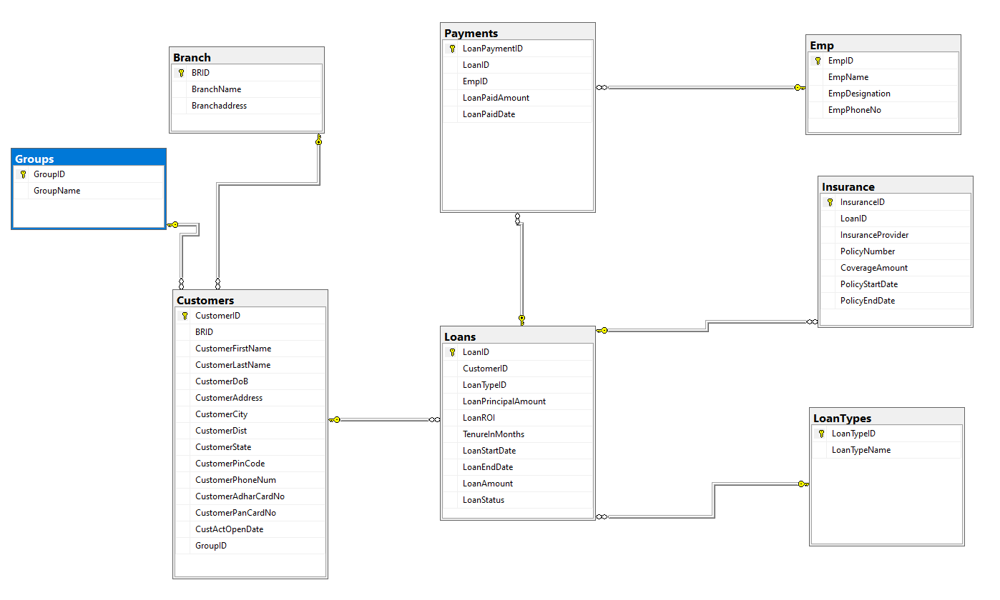

# 🏦 Finance-Bandhan Bank — End-to-End Business Intelligence & Analytics Project
## **About Bandhan Bank Project**

## 🏦 About Bandhan Bank Project

Bandhan began in **2001** with a focus on **financial inclusion** and **women’s empowerment**, providing **microfinance services** to underserved communities through a **group-based lending model**. In this model, customers form groups and individual members receive loans based on their requirements, with the group supporting **timely repayment**.

The project covers **Weekly Loans** and **Monthly Loans**, where customers make regular **EMI repayments**, including applicable interest, based on the **loan duration**. The objective of the project is to design a structured **database and data model** to manage **customers, groups, loans, loan types, and payments**.

The solution also uses **Power BI reports and dashboards** to analyze **loan performance, repayment trends, customer behavior, and business insights**, helping business and operations teams make **data-driven decisions**.

## 🎯 Project Objectives

- Build an **end-to-end Business Intelligence solution** using SQL Server, SSIS, and Power BI.
- Design a structured **data warehouse and star schema** to support efficient reporting and analytics.
- Analyze **loan distribution, customer behavior, repayment patterns, EMI performance, and loan portfolio trends**.
- Identify **high-performing and under-performing branches and regions** to support operational decision-making.
- Track **delinquency, repayment efficiency, and borrower churn/risk patterns**.
- Develop interactive **Power BI dashboards and KPIs** to provide actionable insights for business and operations teams.
- Automate **ETL processes and data refreshes** to deliver reliable and timely reporting.

## 🛠️ Tech Stack

| **Category** | **Technology** | **Purpose** |
| ------------ | -------------- | ----------- |
| **Database** | **SQL Server (T-SQL)** | Data extraction, transformation, and analysis |
| **ETL** | **SSIS** | Data integration, ETL workflows, and data loading |
| **Data Transformation** | **Power Query (M)** | Data cleaning and transformation |
| **Data Modeling** | **Star Schema** | Dimensional data warehouse modeling |
| **Analytics** | **DAX** | Measures, KPIs, and business calculations |
| **Visualization** | **Power BI** | Interactive dashboards and reporting |
| **Automation** | **SQL Server Agent** | ETL scheduling and automation |

## 🗄️ Database Design — OLTP

The project starts with a **normalized OLTP relational database** designed to manage day-to-day banking operations. The database contains entities such as **Customers, Groups, Branches, Loans, Loan Types, Payments, Insurance, and Employees**.

### 📌 OLTP Entity Relationship Diagram

The OLTP database maintains relationships between customers, groups, branches, loans, payments, loan types, insurance, and employees using **Primary Keys (PKs)** and **Foreign Keys (FKs)**.

---
